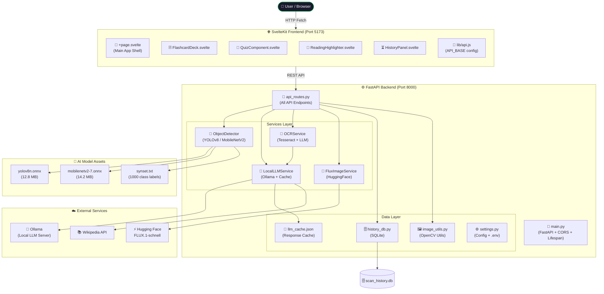
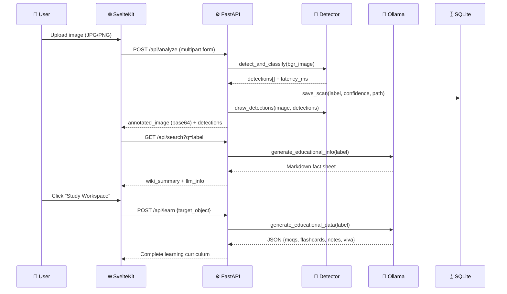

<div align="center">

# 🔬 VisionAI Edge

### *Where Computer Vision Meets Intelligent Learning*

**An AI-powered educational vision platform that combines computer vision, OCR, local LLMs, and generative AI to transform any image into an immersive, interactive learning experience — entirely offline.**

<br/>

[](https://fastapi.tiangolo.com/)
[](https://kit.svelte.dev/)
[](https://python.org/)
[](https://ollama.com/)
[](https://opencv.org/)
[](https://sqlite.org/)
[](LICENSE)

<br/>

> **Upload an image. Detect what's in it. Learn everything about it.**
> AI-generated quizzes, flashcards, viva questions, document intelligence, specimen comparisons, text-to-speech narration, and AI image generation — all running locally on your machine.

</div>

---

## 📋 Table of Contents

- [✨ Feature Overview](#-feature-overview)
- [🤖 AI Technologies](#-ai-technologies)
- [🏗️ Architecture](#️-architecture)
- [🗺️ Feature Walkthrough](#️-feature-walkthrough)
- [📸 Screenshots](#-screenshots)
- [🚀 Quick Start](#-quick-start)
- [⚙️ Installation](#️-installation)
- [🔑 Environment Variables](#-environment-variables)
- [▶️ Running Locally](#️-running-locally)
- [📡 API Reference](#-api-reference)
- [📁 Project Structure](#-project-structure)
- [🔐 Security](#-security)
- [🗺️ Roadmap](#️-roadmap)
- [🤝 Contributing](#-contributing)
- [📄 License](#-license)

---

## ✨ Feature Overview

VisionAI Edge is a full-stack, offline-first platform that closes the gap between raw image data and deep educational insight. Every feature listed below is fully implemented and production-ready.

<table>
<tr>
<td width="50%">

### 📸 Image Scanner
Upload a JPG/PNG or capture a live webcam snapshot. The platform runs **dual-mode inference** — switch between **MobileNetV2 classification** (1000-class ImageNet) and **YOLOv8 nano object detection** (80-class COCO) on the fly. Results arrive with color-coded bounding boxes, confidence scores, and millisecond latency readouts.

</td>
<td width="50%">

### 🧠 Knowledge Explorer
After detection, VisionAI Edge instantly queries **Wikipedia** for a factual summary and fires the detected label at your **local Ollama LLM** (Llama 3.2 by default) to generate a structured markdown fact sheet: overview, category, key characteristics, uses, and educational notes.

</td>
</tr>
<tr>
<td width="50%">

### 💬 Contextual AI Chat
An in-session conversation interface powered by Ollama. Ask follow-up questions about any detected object — the LLM maintains full conversation history and responds with scientifically accurate, context-aware answers in 2–3 sentences. Works entirely offline.

</td>
<td width="50%">

### 🎓 Study Workspace (Learning Center)
Input any concept or use the auto-populated detected label to generate a complete study curriculum via Ollama's structured JSON output: **5 MCQs**, **5 flashcards**, **revision notes**, a **500-word full explanation**, and **5 viva voce questions** — all in one API call.

</td>
</tr>
<tr>
<td width="50%">

### 🃏 Flashcard Deck
A beautiful **3D flip-card** study deck with CSS `preserve-3d` perspective transforms. Each card shows the question on the front and a TTS-narrated answer on the back. Navigation dots track progress. Cards reset automatically when a new specimen is loaded.

</td>
<td width="50%">

### 🧩 Quiz Engine
An interactive MCQ diagnostic with a real-time progress bar, answer locking, **intelligent multi-format answer matching** (single-letter index, full-text, prefix variants), color-coded correct/incorrect feedback, percentage scoring, achievement badges, and a **confetti celebration** on perfect scores.

</td>
</tr>
<tr>
<td width="50%">

### 📖 Reading Highlighter & TTS
Every piece of AI-generated markdown content is wrapped in the **ReadingHighlighter** component. It parses markdown to HTML, injects `<span>` tags around each word, and uses the **Web Speech API** to narrate the text — **highlighting each word in real time** as it is spoken, with adjustable speed (0.5× – 2.0×).

</td>
<td width="50%">

### 📄 Document Intelligence (OCR)
Upload a document image and **Tesseract OCR** extracts all text offline. Ollama then analyzes the extracted text to produce a structured study guide: executive summary, 8 key points, glossary of technical terms, interview questions, and exam-style questions.

</td>
</tr>
<tr>
<td width="50%">

### ⚖️ Specimen Comparator
Compare any two concepts side-by-side. Ollama generates a structured markdown report with a comparison table (8+ rows covering size, materials, energy, function, lifespan, environmental impact, cost, and history), similarities, differences, and educational insights.

</td>
<td width="50%">

### 🎨 AI Image Studio (FLUX)
A text-to-image generation studio powered by **Hugging Face FLUX.1-schnell** (black-forest-labs). Enter a natural language prompt, generate a 1024×1024 PNG in ~4 inference steps, and the image is automatically saved locally and logged in the generation history gallery.

</td>
</tr>
<tr>
<td width="50%">

### ⏳ Scan History
Every successful image scan is persisted in **SQLite** with the detected label, confidence score, timestamp, and a 150px JPEG thumbnail (base64). The History Panel allows per-record deletion, bulk clearing, and one-click re-inspection that re-triggers the full knowledge pipeline for any past scan.

</td>
<td width="50%">

### 🔍 Knowledge Search
A standalone search bar that queries Wikipedia for a factual summary and image, then fires the query through Ollama for a full educational fact sheet — without needing to upload an image first. Useful for exploring any concept directly.

</td>
</tr>
</table>

### ⚡ Additional Platform Features

| Feature | Description |
|---|---|
| **Demo Mode** | A fully simulated offline demo with Tiger specimen data — works with no backend or network connection |
| **Webcam Capture** | Live `getUserMedia` webcam feed with snapshot-to-inference pipeline |
| **Study Streak System** | Daily streak tracking via `localStorage` with visual badge rewards |
| **Achievement Badges** | Earned for scan milestones, streak days, and perfect quiz scores |
| **Animated Scan Pipeline** | 5-step visual state machine: detect → animate confidence bars → load knowledge → reveal facts → learning ready |
| **LLM Response Cache** | All Ollama responses cached to `llm_cache.json` via MD5-keyed JSON file — instant repeat queries |
| **Self-Healing Data Validation** | Malformed LLM JSON output is automatically detected and repaired section-by-section via fallback prompts |
| **Image Generation History** | Gallery of all FLUX-generated images with prompts, timestamps, and generation times; supports per-image deletion |
| **CORS-Secured Backend** | FastAPI backend only accepts connections from `localhost:5173` |
| **Dynamic Engine Switching** | Switch between YOLOv8 and MobileNetV2 at runtime without restarting the server |

---

## 🤖 AI Technologies

<table>
<tr>
<th>Technology</th>
<th>Role in VisionAI Edge</th>
<th>Implementation Detail</th>
</tr>
<tr>
<td><b>🦾 YOLOv8 Nano (ONNX)</b></td>
<td>Multi-object detection</td>
<td>Detects 80 COCO classes. Input: 640×640 blob. Output: 8400 anchors parsed with Non-Maximum Suppression (NMS, threshold 0.45). Coordinates rescaled to original image dimensions.</td>
</tr>
<tr>
<td><b>🧬 MobileNetV2 (ONNX)</b></td>
<td>1000-class image classification</td>
<td>ImageNet classification with ImageNet normalization (mean=[0.485,0.456,0.406], std=[0.229,0.224,0.225]). Softmax applied manually. Contour-based ROI extraction identifies sub-regions before full-image fallback.</td>
</tr>
<tr>
<td><b>🖼️ OpenCV (cv2.dnn)</b></td>
<td>ONNX model runner, image processing, annotation</td>
<td>Runs both models via `cv2.dnn.readNetFromONNX`. Handles blobFromImage preprocessing, Canny edge detection + morphological operations for ROI extraction, and draws color-coded bounding boxes with dynamic font scaling.</td>
</tr>
<tr>
<td><b>🦙 Ollama (Llama 3.2:3b)</b></td>
<td>Local LLM for all text generation</td>
<td>Serves educational fact sheets, quiz generation (JSON format mode), comparison reports, document analysis, and contextual chat. Fast socket pre-check before each request. Configurable host, model, and timeout (45s).</td>
</tr>
<tr>
<td><b>🔬 Tesseract OCR</b></td>
<td>Offline document text extraction</td>
<td>Invoked via `pytesseract`. Auto-detects Tesseract binary on Windows across common installation paths. Returns raw text string and method label ("Tesseract OCR (Offline)").</td>
</tr>
<tr>
<td><b>⚡ Hugging Face FLUX.1-schnell</b></td>
<td>AI image generation</td>
<td>Uses `huggingface_hub.InferenceClient` with provider="auto". Generates 1024×1024 PNGs in 4 inference steps with guidance_scale=0.0 (flow matching, no CFG needed). EXIF transpose normalization applied before save.</td>
</tr>
<tr>
<td><b>🌐 Wikipedia API</b></td>
<td>Factual knowledge retrieval</td>
<td>Two-stage query: search API → page details API. Fetches the top result's main image (original resolution URL) and first 300 characters of extract text.</td>
</tr>
<tr>
<td><b>🔊 Web Speech API</b></td>
<td>Text-to-speech narration</td>
<td>Browser-native `SpeechSynthesisUtterance`. `onboundary` events track char index → mapped to word index → DOM span highlighted in real time. Speed adjustable from 0.5× to 2.0×.</td>
</tr>
</table>

---

## 🏗️ Architecture

### System Architecture Diagram



### Request-Response Flow



---

## 🗺️ Feature Walkthrough

### The Complete Learning Journey

```
📸 CAPTURE                🔬 DETECT               🧠 LEARN
─────────                 ────────                 ──────────
Upload image         →    YOLOv8 / MobileNetV2  →  Ollama fact sheet
  OR webcam               bounding boxes            Wikipedia summary
  snapshot                confidence scores          Contextual chat

🃏 MEMORIZE              🧩 TEST                  📖 READ ALOUD
───────────               ──────                   ──────────────
3D flip flashcards   →    5-question MCQ quiz  →   TTS narration
  front: question          real-time scoring         word-level highlight
  back: TTS answer         confetti on 100%          speed control

📄 SCAN DOCS             ⚖️ COMPARE               🎨 CREATE
────────────              ──────────               ──────────
Tesseract OCR        →    Ollama comparison    →   FLUX image gen
  document text            detailed table            1024×1024 PNG
  Ollama study guide        similarities              generation log
  key terms + Q&A           differences
```

---

## 📸 Screenshots

> **Live Interface Sections** — VisionAI Edge runs as a dark-mode, single-page application with tab-based navigation.

### 📸 Image Scanner Tab
The primary interface. Upload or webcam-capture an image, select the AI engine (YOLOv8 or MobileNetV2), and set the confidence threshold. Results display an annotated image with colored bounding boxes, a confidence progress bar, and automatic Knowledge Explorer panel.

```
[ Image Scanner Tab ]
┌─────────────────────────────────────────────────────────────┐
│  ENGINE: [MobileNetV2 ▼]  CONFIDENCE: [0.25 ──●── 1.0]     │
│  ┌──────────────────┐  ┌────────────────────────────────┐   │
│  │   DROP IMAGE     │  │  📦 Tiger        ████████ 96%  │   │
│  │   OR WEBCAM      │  │  📦 Felidae      ██████   72%  │   │
│  │   [Browse File]  │  │  latency: 142ms  1280x720      │   │
│  └──────────────────┘  └────────────────────────────────┘   │
│  [ Annotated Image with bounding boxes here ]               │
└─────────────────────────────────────────────────────────────┘
```

### 🧠 Knowledge Explorer Panel
Auto-populated after every scan. Shows Wikipedia summary, Ollama fact sheet (Overview / Category / Key Characteristics / Common Uses / Interesting Facts / Educational Notes), and the AI chat dialog.

### 🎓 Study Workspace Tab
Tabbed layout: **Full Explanation** → **Flashcard Deck** (3D flip) → **MCQ Quiz** → **Revision Notes** → **Viva Q&A**. All content rendered via ReadingHighlighter with TTS.

### 📄 Document Intelligence Tab
Upload any document scan image. Displays raw extracted text and Ollama's structured study guide side by side.

### ⚖️ Specimen Comparator Tab
Two text fields for concept A and B. Generates a markdown comparison table plus educational insights, rendered with the ReadingHighlighter.

### 🎨 AI Image Studio Tab
Text prompt input + generate button. Displays generated 1024×1024 image with metadata. Below, a scrollable gallery of past generated images with prompts, generation times, and delete controls.

---

## 🚀 Quick Start

```bash
# 1. Clone the repository
git clone https://github.com/your-username/VisionAI.git
cd VisionAI

# 2. Configure environment
cp .env.example backend/.env
# Edit backend/.env and add your HUGGINGFACE_API_KEY

# 3. Install and pull Ollama model
ollama pull llama3.2:3b

# 4. Windows — One-command launch
run.bat

# The script will:
# → Create Python venv if missing
# → Install all pip dependencies
# → Install npm packages if missing
# → Kill any process on port 8000
# → Launch FastAPI on http://localhost:8000
# → Launch SvelteKit on http://localhost:5173
# → Open your browser automatically
```

---

## ⚙️ Installation

### Prerequisites

| Requirement | Version | Purpose |
|---|---|---|
| **Python** | 3.11+ | Backend runtime |
| **Node.js** | 18+ | SvelteKit frontend |
| **Ollama** | Latest | Local LLM server |
| **Tesseract OCR** | 5.x | Document text extraction |
| **Git** | Any | Source control |

### Step-by-Step Installation

<details>
<summary><b>🪟 Windows</b></summary>

```powershell
# Install Python 3.11+
# https://www.python.org/downloads/windows/

# Install Node.js 18+
# https://nodejs.org/

# Install Tesseract OCR (adds to PATH automatically)
# https://github.com/UB-Mannheim/tesseract/wiki
# Default install path: C:\Program Files\Tesseract-OCR\

# Install Ollama
# https://ollama.com/download/windows
ollama pull llama3.2:3b

# Clone and run
git clone https://github.com/your-username/VisionAI.git
cd VisionAI
copy .env.example backend\.env
# Edit backend\.env with your HuggingFace token
run.bat
```

</details>

<details>
<summary><b>🐧 Linux</b></summary>

```bash
# Install Python, Node.js, Tesseract
sudo apt update
sudo apt install python3.11 python3.11-venv nodejs npm tesseract-ocr

# Install Ollama
curl -fsSL https://ollama.com/install.sh | sh
ollama pull llama3.2:3b

# Clone
git clone https://github.com/your-username/VisionAI.git
cd VisionAI
cp .env.example backend/.env
# Edit backend/.env

# Backend
python3.11 -m venv venv
source venv/bin/activate
pip install -r requirements.txt
python -m uvicorn backend.main:app --host 127.0.0.1 --port 8000 &

# Frontend (new terminal)
npm install
npm run dev
```

</details>

<details>
<summary><b>🍎 macOS</b></summary>

```bash
# Install Homebrew if missing
/bin/bash -c "$(curl -fsSL https://raw.githubusercontent.com/Homebrew/install/HEAD/install.sh)"

# Install dependencies
brew install python@3.11 node tesseract

# Install Ollama
brew install ollama
ollama serve &
ollama pull llama3.2:3b

# Clone
git clone https://github.com/your-username/VisionAI.git
cd VisionAI
cp .env.example backend/.env
# Edit backend/.env

# Backend
python3.11 -m venv venv
source venv/bin/activate
pip install -r requirements.txt
python -m uvicorn backend.main:app --host 127.0.0.1 --port 8000 &

# Frontend (new terminal)
npm install
npm run dev
```

</details>

---

## 🔑 Environment Variables

Copy `.env.example` to `backend/.env` and configure the following:

| Variable | Required | Default | Description |
|---|---|---|---|
| `HUGGINGFACE_API_KEY` | **Yes*** | — | Hugging Face API token with **Inference Providers** permission. Required for AI Image Studio. Obtain at [hf.co/settings/tokens](https://huggingface.co/settings/tokens) |
| `OLLAMA_MODEL` | No | `llama3.2:3b` | The Ollama model tag to use. Can be any model available via `ollama list` |
| `OLLAMA_HOST` | No | `http://localhost:11434` | Ollama server URL. Change if running Ollama on a remote machine or non-standard port |

> **\*** The `HUGGINGFACE_API_KEY` is only required for the AI Image Studio tab. All other features (vision detection, LLM, OCR, chat, quiz, flashcards) work without it.

**Before using FLUX.1-schnell, you must:**
1. Accept the model terms at [huggingface.co/black-forest-labs/FLUX.1-schnell](https://huggingface.co/black-forest-labs/FLUX.1-schnell)
2. Grant your token the **Inference Providers** permission in your HuggingFace account settings

---

## ▶️ Running Locally

### Production-like start (Windows — Recommended)

```bat
run.bat
```

This script handles venv creation, dependency installation, port cleanup, and browser launch automatically.

### Manual start (any OS)

**Terminal 1 — Backend:**
```bash
# Activate virtual environment
# Windows:
venv\Scripts\activate
# Linux/macOS:
source venv/bin/activate

# Start FastAPI server
python -m uvicorn backend.main:app --host 127.0.0.1 --port 8000 --reload
```

**Terminal 2 — Frontend:**
```bash
npm run dev
```

**Access the app:** [http://localhost:5173](http://localhost:5173)
**API documentation:** [http://localhost:8000/docs](http://localhost:8000/docs) (Swagger UI)

---

## 📡 API Reference

All endpoints are served by FastAPI at `http://127.0.0.1:8000`. Interactive docs available at `/docs`.

### Vision & Analysis

| Method | Endpoint | Description | Body / Params |
|---|---|---|---|
| `GET` | `/api/status` | Returns Ollama connectivity, active model, and vision engine mode | — |
| `POST` | `/api/analyze` | Runs object detection/classification on an uploaded image. Returns annotated image (base64), detections array, latency, and resolution. Saves top detection to SQLite. | `file` (multipart), `engine_mode` (str: `classification`\|`detection`), `confidence_threshold` (float) |
| `GET` | `/api/search` | Searches Wikipedia and queries Ollama for structured educational fact sheet | `q` (str, query param) |

### Learning & Education

| Method | Endpoint | Description | Body |
|---|---|---|---|
| `POST` | `/api/learn` | Generates complete study curriculum (MCQs, flashcards, revision notes, viva Q&A, full explanation) via Ollama JSON mode | `{"target_object": "Tiger"}` |
| `POST` | `/api/chat` | Contextual AI chat about a detected object, maintaining conversation history | `{"selected_label": "Tiger", "messages": [{"role": "user", "content": "..."}]}` |
| `POST` | `/api/compare` | Generates structured markdown comparison between two concepts | `{"object_a": "Tiger", "object_b": "Lion"}` |

### Document Intelligence

| Method | Endpoint | Description | Body |
|---|---|---|---|
| `POST` | `/api/ocr` | Extracts text via Tesseract OCR and optionally generates an Ollama study guide | `file` (multipart image) |

### Scan History

| Method | Endpoint | Description |
|---|---|---|
| `GET` | `/api/history` | Returns all scan records (id, object_name, confidence, timestamp, thumbnail) ordered by most recent |
| `DELETE` | `/api/history/{record_id}` | Deletes a specific scan record and its associated uploaded image file |
| `POST` | `/api/history/clear` | Clears all scan records and deletes all uploaded image files |

### AI Image Generation

| Method | Endpoint | Description | Body |
|---|---|---|---|
| `POST` | `/api/image/generate` | Generates a 1024×1024 image via FLUX.1-schnell and saves locally | `{"prompt": "A tiger in a forest at sunset"}` |
| `GET` | `/api/image/history` | Returns all image generation records with resolved image URLs |
| `DELETE` | `/api/image/history/{record_id}` | Deletes a specific image generation record and its PNG file |
| `POST` | `/api/image/history/clear` | Clears all image generation records and deletes all generated PNGs |

### Static Assets

| Path | Description |
|---|---|
| `/generated-images/{filename}` | Serves generated FLUX PNG images from `uploads/generated/` |

---

## 📁 Project Structure

```
VisionAI/
│
├── 📄 run.bat                    # One-command Windows launcher
├── 📄 .env.example               # Environment variable template
├── 📄 requirements.txt           # Python dependencies
├── 📄 package.json               # Node.js / SvelteKit dependencies
├── 📄 svelte.config.js           # SvelteKit configuration + path aliases
├── 📄 vite.config.js             # Vite bundler configuration
│
├── 🗂️ backend/                   # FastAPI Python backend
│   ├── 📄 main.py                # App factory, CORS middleware, lifespan
│   ├── 🗂️ config/
│   │   └── 📄 settings.py        # Typed settings dataclass, env loading
│   ├── 🗂️ routes/
│   │   └── 📄 api_routes.py      # All 12 API endpoint handlers
│   ├── 🗂️ services/
│   │   ├── 🗂️ vision/
│   │   │   └── 📄 detector.py    # ObjectDetector (YOLOv8 + MobileNetV2)
│   │   ├── 🗂️ llm/
│   │   │   └── 📄 local_llm_service.py  # Ollama client, cache, all prompts
│   │   ├── 🗂️ ocr/
│   │   │   └── 📄 ocr_service.py # Tesseract OCR + LLM analysis bridge
│   │   └── 🗂️ image_generation/
│   │       └── 📄 flux_image_service.py # FLUX via HuggingFace InferenceClient
│   ├── 🗂️ models/
│   │   └── 📄 domain_models.py   # Pydantic request models
│   ├── 🗂️ database/
│   │   ├── 📄 history_db.py      # SQLite CRUD + thumbnail generation
│   │   └── 🗄️ scan_history.db    # SQLite database (gitignored)
│   └── 🗂️ utils/
│       └── 📄 image_utils.py     # File validation, OpenCV utils, Wikipedia fetch
│
├── 🗂️ frontend/                  # SvelteKit frontend
│   ├── 📄 app.html               # HTML shell template
│   ├── 🗂️ routes/
│   │   ├── 📄 +layout.svelte     # Root layout
│   │   └── 📄 +page.svelte       # Main SPA (all tabs, state machine, API calls)
│   ├── 🗂️ components/
│   │   ├── 📄 FlashcardDeck.svelte      # 3D flip card deck
│   │   ├── 📄 QuizComponent.svelte      # MCQ quiz with scoring + confetti
│   │   ├── 📄 ReadingHighlighter.svelte # TTS + word-level highlight engine
│   │   └── 📄 HistoryPanel.svelte       # SQLite scan history browser
│   └── 🗂️ lib/
│       ├── 📄 api.js             # API_BASE constant + asset resolver
│       └── 📄 app.css            # Global design system (CSS variables, dark theme)
│
├── 🗂️ assets/                    # AI model files (bundled, not in git)
│   ├── 🧠 yolov8n.onnx           # YOLOv8 nano (12.8 MB)
│   ├── 🧠 mobilenetv2-7.onnx     # MobileNetV2 (14.2 MB)
│   └── 📄 synset.txt             # ImageNet 1000-class label file
│
├── 🗂️ uploads/                   # Runtime image storage (gitignored)
│   └── 🗂️ generated/            # FLUX-generated PNG images
│
├── 🗂️ static/                    # SvelteKit static assets
│   └── 📄 robots.txt
│
└── 📄 llm_cache.json             # Persistent LLM response cache (gitignored)
```

---

## 🔐 Security

VisionAI Edge is designed with a **backend-first security model**:

| Practice | Implementation |
|---|---|
| **API Key isolation** | `HUGGINGFACE_API_KEY` and Ollama config live in `backend/.env`, which is in `.gitignore` and never served to the browser |
| **CORS restriction** | FastAPI only allows cross-origin requests from `http://127.0.0.1:5173` and `http://localhost:5173` — no public network exposure |
| **File validation** | Uploads restricted to `.jpg`, `.jpeg`, `.png` extensions and a 10 MB maximum file size, enforced server-side before any model inference |
| **Path traversal prevention** | File deletion logic validates that target paths resolve inside `uploads/generated/` before unlinking |
| **No secret exposure** | The SvelteKit frontend has no access to any API key — all external service calls (HuggingFace, Ollama) happen server-side in FastAPI |
| **Local-only LLM** | Ollama runs entirely on your machine; no conversation content leaves your system |
| **Prompt length cap** | Image generation prompts are server-side limited to 1000 characters |
| **Environment isolation** | Python dependencies run inside a `venv` isolated from system Python |

---

## 🗺️ Roadmap

| Priority | Feature | Status |
|---|---|---|
| 🔴 High | Export learning data (PDF study guide, quiz results) | Planned |
| 🔴 High | Multi-image batch scanning | Planned |
| 🟡 Medium | User accounts and persistent study progress | Planned |
| 🟡 Medium | Custom Ollama model selection from UI | Planned |
| 🟡 Medium | Real-time webcam video object detection (streaming mode) | Planned |
| 🟢 Nice-to-have | Spaced Repetition System (SRS) for flashcard review scheduling | Planned |
| 🟢 Nice-to-have | Multi-language OCR and TTS support | Planned |
| 🟢 Nice-to-have | Plugin system for custom AI services | Planned |
| 🟢 Nice-to-have | Mobile PWA with offline service worker | Planned |
| 🟢 Nice-to-have | Docker Compose one-command deployment | Planned |

---

## 🤝 Contributing

Contributions are welcome and appreciated. VisionAI Edge follows a clean, service-oriented architecture that makes it easy to add new AI capabilities.

### Getting Started

```bash
# 1. Fork the repository on GitHub
# 2. Clone your fork
git clone https://github.com/your-username/VisionAI.git
cd VisionAI

# 3. Create a feature branch
git checkout -b feature/your-feature-name

# 4. Set up your development environment
cp .env.example backend/.env
python -m venv venv
source venv/bin/activate  # or venv\Scripts\activate on Windows
pip install -r requirements.txt
npm install

# 5. Make your changes and test them
# 6. Commit with a clear message
git commit -m "feat: add multi-language OCR support"

# 7. Push and open a Pull Request
git push origin feature/your-feature-name
```

### Contribution Guidelines

- **Backend services** live in `backend/services/`. Each service should be a self-contained class with a clear constructor and public methods.
- **New API endpoints** go in `backend/routes/api_routes.py`. Use Pydantic models for request bodies in `backend/models/domain_models.py`.
- **Frontend components** live in `frontend/components/`. Use Svelte 5 runes (`$state`, `$props`, `$effect`, `$derived`).
- **All AI responses** should leverage the `LocalLLMService` caching system to avoid redundant LLM calls.
- **No secrets in code** — all API keys and configuration must go through `backend/.env` and `settings.py`.
- Follow existing code style (Python: standard PEP 8; JS/Svelte: existing component conventions).
- Write clear docstrings for all new Python functions and classes.

### What We Welcome

- 🐛 Bug fixes and error handling improvements
- 🚀 New AI service integrations (additional ONNX models, embedding support)
- 🎨 UI/UX enhancements to the SvelteKit interface
- 📚 Additional learning tools (spaced repetition, concept mapping)
- 🌍 Internationalization and accessibility improvements
- 🧪 Unit and integration tests

---

## 📄 License

```
MIT License

Copyright (c) 2026 VisionAI Edge Contributors

Permission is hereby granted, free of charge, to any person obtaining a copy
of this software and associated documentation files (the "Software"), to deal
in the Software without restriction, including without limitation the rights
to use, copy, modify, merge, publish, distribute, sublicense, and/or sell
copies of the Software, and to permit persons to whom the Software is
furnished to do so, subject to the following conditions:

The above copyright notice and this permission notice shall be included in all
copies or substantial portions of the Software.

THE SOFTWARE IS PROVIDED "AS IS", WITHOUT WARRANTY OF ANY KIND, EXPRESS OR
IMPLIED, INCLUDING BUT NOT LIMITED TO THE WARRANTIES OF MERCHANTABILITY,
FITNESS FOR A PARTICULAR PURPOSE AND NONINFRINGEMENT. IN NO EVENT SHALL THE
AUTHORS OR COPYRIGHT HOLDERS BE LIABLE FOR ANY CLAIM, DAMAGES OR OTHER
LIABILITY, WHETHER IN AN ACTION OF CONTRACT, TORT OR OTHERWISE, ARISING FROM,
OUT OF OR IN CONNECTION WITH THE SOFTWARE OR THE USE OR OTHER DEALINGS IN THE
SOFTWARE.
```

---

<div align="center">

**Built with 🧠 intelligence, 💚 SvelteKit, and ⚡ FastAPI**

[Report a Bug](https://github.com/your-username/VisionAI/issues) · [Request a Feature](https://github.com/your-username/VisionAI/issues) · [Read the Docs](#-api-reference)

</div>
